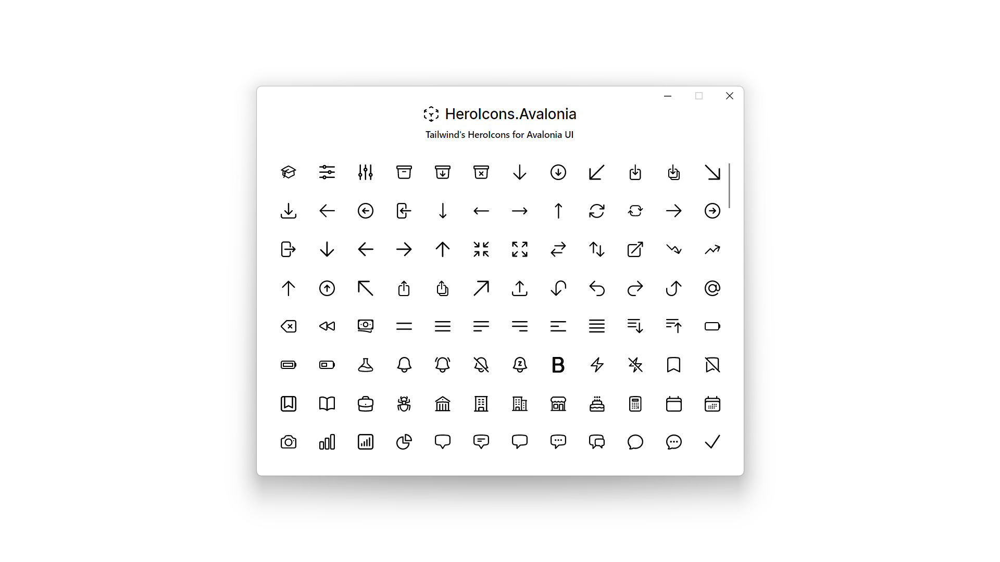



<h2 align="center">HeroIcons.Avalonia</h2>

The beautiful handcrafted Icons by the makers of Tailwind CSS
made available to your awesome Avalonia UI projects!

<h4 align="center">HeroIcons.Avalonia Demo App</h4>

### How to Use

### Donate

If you find this project helpful, please consider donating. It helps me afford more time to create tools like this
for the community. ❤

### Special Message
Special thanks to [JetBrains](https://www.jetbrains.com/) for supporting this project by providing licences to the JetBrains Suite!

